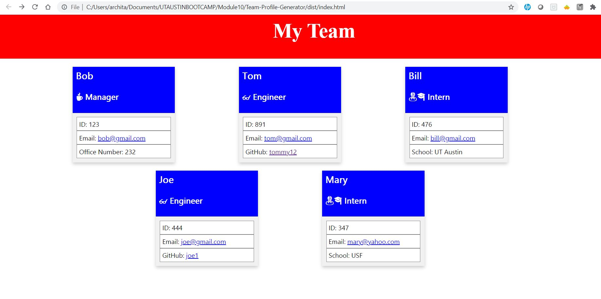

# Team-Profile-Generator

## Purpose

A command-line application that takes in information about employees on a software engineering team and generates an HTML webpage that displays summaries for each person on the team and this application unit tests. 

## Built With

- HTML
- CSS
- Node.js
- Inquirer package
- fs
- Jest package 

## Website

Link to walk-through video:
https://drive.google.com/file/d/1NrQKLpW0UvqGXbB6AlbLXLomEwNltuUF/view?usp=sharing

## Contribution

Made by Archita